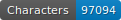
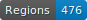
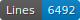
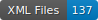

# HTR-Varia-Malingre

   

Ce dépôt comprend les données OCR des textes littéraires qui ont des liens avec l'œuvre du poète réformé M. Malingre (c.1500-1572). La liste des textes avec plus de détails se trouve dans le [tableau CSV](https://github.com/SETAFDH/HTR-Varia-Malingre/blob/main/HTR-Varia-Malingre_Table.csv) du dépôt (par exemple, une colonne indique si la trascription est issue d'une typographie gothique ou romaine).

Les ouvrages attribués à M. Malingre, imprimés par Pierre de Vingle et Jean Michel, se trouvent dans les dépots [HTR-SETAF-Pierre-de-Vingle](https://github.com/SETAFDH/HTR-SETAF-Pierre-de-Vingle) et [HTR-SETAF-Jean-Michel](https://github.com/SETAFDH/HTR-SETAF-Jean-Michel). 


## Financeur

Ce projet est financé par le Fonds national suisse (FNS) dans le cadre du projet SETAF.

- Site du projet SETAF : https://www.unige.ch/setaf
- GitHub du projet SETAF : https://github.com/SETAFDH


## Licence

Les transcriptions sont [CC-BY](https://creativecommons.org/licenses/by/4.0), et les images suivent les règles de différentes bibliothèques numériques : [e-rara](https://www.e-rara.ch/wiki/termsOfUse?lang=en), [ONB](https://www.onb.ac.at/en/use), [Gallica](https://gallica.bnf.fr/edit/und/conditions-dutilisation-des-contenus-de-gallica), [BSB](https://oai.bsb-muenchen.de/doc/en/imprint).


## Données

Les données se trouvent au chemin ‘./data//.xml‘ et sont au format ALTO. Elles suivent les normes de segmentation de [SegmOnto](https://segmonto.github.io) et sont cataloguées sur [HTR-United](https://htr-united.github.io). Les fichiers sont corrigés manuellement : la qualité de la segmentation des pages et de la transcription produite par l'OCR est indiqué dans le tableau CSV du dépôt ("gold" ou "en cours").

Le contrôle de la transcription produite par l'OCR se base sur un guide redigé par l'équipe du projet : Solfrini et al., _Guide de transcription pour les imprimés français du XVIe siècle en caractères gothiques_, Version A, 2023, https://hal.science/hal-04281804.


## Infrastructure

Les données pour l'OCR sont produites à l'aide de l’instance genevoise [FoNDUE](https://www.unige.ch/lettres/humanites-numeriques/recherche/projets-de-la-chaire/fondue) d'[eScriptorium](https://gitlab.com/scripta/escriptorium).

Les calculs sont effectués à l'Université de Genève en utilisant le [service HPC](https://www.unige.ch/eresearch/fr/services/hpc/).
  

## Citer le dépôt

- Version `1.0`: Sonia Solfrini, _Données OCR et segmentation des textes littéraires qui ont des liens avec l'œuvre de M. Malingre_, version `1.0`, Genève, université de Genève, 2023, https://github.com/SETAFDH/HTR-Varia-Malingre.

```bibtex
@misc{solfrini_ocr_varia_malingre_2023,
  author={Solfrini, Sonia},
  title={Données OCR et segmentation des textes littéraires qui ont des liens avec l'œuvre de M. Malingre},
  version={1.0},
  address={Genève},
  publisher={université de Genève},
  year={2023},
  url={https://github.com/SETAFDH/HTR-Varia-Malingre},
}
```
